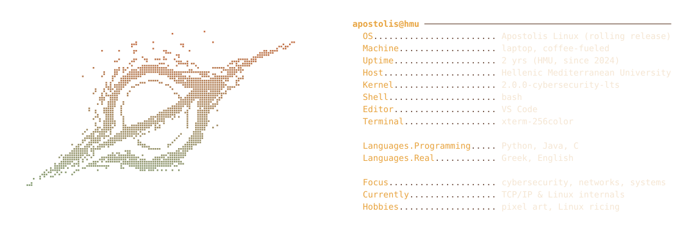

  

  

### Featured Projects

| Repo | What it does | Tech |
|---|---|---|
| [`port-scanner`](https://github.com/ApostolisMou/port-scanner) | Multithreaded TCP port scanner (stdlib only) — built to understand how tools like nmap work under the hood | Python |
| [`log-analyzer`](https://github.com/ApostolisMou/log-analyzer) | Parses SSH auth logs and flags IPs with brute-force-like failed login patterns | Python |
| [`cipher-toolkit`](https://github.com/ApostolisMou/cipher-toolkit) | CLI toolkit for Caesar and Vigenère ciphers, including frequency-analysis brute-force cracking | Python |
| [`password-strength-checker`](https://github.com/ApostolisMou/password-strength-checker) | CLI tool estimating password strength via entropy and a common-password check | Python |
